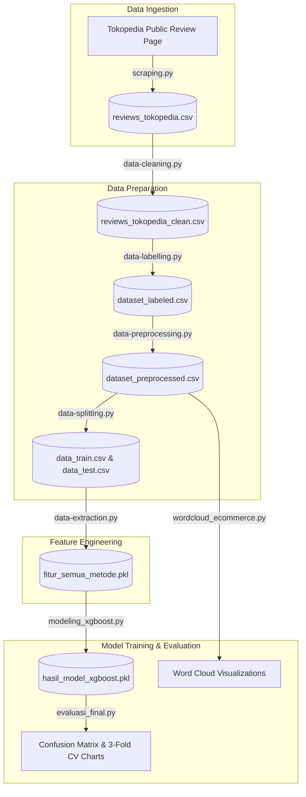

# 🛍️ Indonesian E-Commerce Clothing Review: Sentiment Analysis & NLP Benchmarking

[](https://www.python.org/)
[](https://scikit-learn.org/)
[](https://xgboost.readthedocs.io/)
[](https://radimrehurek.com/gensim/)
[](https://opensource.org/licenses/MIT)

An end-to-end Machine Learning and Natural Language Processing (NLP) pipeline that scrapes, preprocesses, vectorizes, classifies, and evaluates customer sentiment on Indonesian clothing brands (**Erigo**, **3Second**, **Minimal**, **Eiger**) from Tokopedia.

This project benchmarks **4 feature extraction techniques** (**Bag-of-Words**, **TF-IDF**, **Word2Vec**, and **Doc2Vec**) paired with an **XGBoost Classifier** optimized for severe class imbalance via dynamic `scale_pos_weight`.

---

## 📌 Table of Contents
- [Project Overview](#-project-overview)
- [Best Practice Directory Structure](#-best-practice-directory-structure)
- [End-to-End Pipeline Execution Flow](#-end-to-end-pipeline-execution-flow)
- [Step-by-Step File Execution Guide](#-step-by-step-file-execution-guide)
  - [Step 1: Web Scraping (`scraping.py`)](#step-1-web-scraping-scrapingpy)
  - [Step 2: Data Cleaning & Deduplication (`data-cleaning.py`)](#step-2-data-cleaning--deduplication-data-cleaningpy)
  - [Step 3: Sentiment Labelling & Audit (`data-labelling.py`)](#step-3-sentiment-labelling--audit-data-labellingpy)
  - [Step 4: Indonesian NLP Preprocessing (`data-preprocessing.py`)](#step-4-indonesian-nlp-preprocessing-data-preprocessingpy)
  - [Step 5: Stratified Train-Test Split (`data-splitting.py`)](#step-5-stratified-train-test-split-data-splittingpy)
  - [Step 6: Comparative Feature Extraction (`data-extraction.py`)](#step-6-comparative-feature-extraction-data-extractionpy)
  - [Step 7: Imbalanced XGBoost Modeling (`modeling_xgboost.py`)](#step-7-imbalanced-xgboost-modeling-modeling_xgboostpy)
  - [Step 8: Rigorous Evaluation & CV (`evaluasi_final.py`)](#step-8-rigorous-evaluation--cv-evaluasi_finalpy)
  - [Step 9: Visual Word Cloud EDA (`wordcloud_ecommerce.py`)](#step-9-visual-word-cloud-eda-wordcloud_ecommercepy)
- [One-Command Pipeline Runner](#-one-command-pipeline-runner)
- [Benchmark Results & Key Findings](#-benchmark-results--key-findings)
- [Installation & Setup](#-installation--setup)

---

## 🚀 Project Overview

Real-world e-commerce customer feedback in Indonesia poses unique NLP challenges:
1. **Slang & Informal Typography:** Heavy use of abbreviations (*bgt*, *gk*, *dgn*, *udh*, *bgs*).
2. **Extreme Class Imbalance:** Over 95% of e-commerce reviews are positive (rating 4–5), making standard accuracy metrics misleading.
3. **Complex Negation Dynamics:** Expressions like *"gak tebel"* (not thick = lightweight/comfortable) can easily be inverted if negation words are mistakenly stripped as stopwords.
4. **Dynamic Single-Page Application (SPA):** Scrapers must navigate client-rendered DOMs without triggering bot mitigations.

This project delivers a complete, reproducible pipeline addressing each challenge from raw web scraping to statistical cross-validation.

---

## 📁 Best Practice Directory Structure

In production data science and machine learning projects (following the **Cookiecutter Data Science** standard), project files are partitioned by data lifecycle and artifact type to ensure reproducibility, clean version control, and modularity.

### Recommended Industry-Standard Layout

```text
analisis-review-toko-online-clothing-terkenal/
├── README.md                           # Master project documentation
├── requirements.txt                    # Project dependencies
├── run_pipeline.py                     # Master execution runner
│
├── data/                               # Data storage (split by stage)
│   ├── raw/                            # Immutable raw inputs & dictionaries
│   │   ├── reviews_tokopedia.csv       # Raw scraped reviews
│   │   ├── kamus_alay_indonesia.csv    # 4,300+ Indonesian slang dictionary
│   │   └── stopwords_id.txt            # Tala stopword corpus
│   └── processed/                      # Cleaned, transformed & partitioned datasets
│       ├── reviews_tokopedia_clean.csv # Deduplicated & template-free reviews
│       ├── dataset_labeled.csv         # Reviews with binary sentiment labels
│       ├── dataset_preprocessed.csv    # Stemmed & normalized tokens
│       ├── data_train.csv              # 80% Stratified training set
│       └── data_test.csv               # 20% Stratified test set
│
├── models/                             # Serialized models and vectorizers
│   ├── bow_vectorizer.pkl              # Fitted CountVectorizer
│   ├── tfidf_vectorizer.pkl            # Fitted TfidfVectorizer
│   ├── word2vec_model.bin              # Trained Word2Vec embeddings (100d)
│   ├── doc2vec_model.bin               # Trained Doc2Vec document model (100d)
│   ├── fitur_semua_metode.pkl          # Combined feature vectors dictionary
│   └── hasil_model_xgboost.pkl         # Trained XGBoost models & predictions
│
├── reports/                            # Analysis figures, charts & summaries
│   ├── figures/
│   │   ├── evaluasi_confusion_matrix.png     # 4-panel confusion matrix comparison
│   │   ├── evaluasi_perbandingan_metode.png  # F1-macro CV bar chart
│   │   └── wordcloud_baik_buruk.png          # Dual-class word cloud comparison
│   └── dictionary_output.pdf                 # PDF summary of data distribution
│
├── src/                                # Modular pipeline source scripts
│   ├── scraping.py                     # Step 1: GraphQL web scraping
│   ├── produk.py                       # Target brand catalogue URLs
│   ├── data-cleaning.py                # Step 2: HTML decode & deduplication
│   ├── data-labelling.py               # Step 3: Threshold-based labelling
│   ├── data-preprocessing.py            # Step 4: Normalization & stemming
│   ├── data-splitting.py               # Step 5: Stratified split
│   ├── data-extraction.py              # Step 6: 4x Vectorization
│   ├── modeling_xgboost.py             # Step 7: XGBoost classifier training
│   ├── evaluasi_final.py               # Step 8: Evaluation & 3-fold CV
│   └── wordcloud_ecommerce.py          # Step 9: Visual word cloud generation
│
└── debug/                              # Diagnostic HTML & JSON dumps (git-ignored)
```

> **Why this structure?**
> - **Separation of Concerns:** Raw data is never modified directly; transformations live in `data/processed/`.
> - **Git Efficiency:** Model binaries (`.bin`, `.pkl`) and visual plots (`.png`) can be versioned via DVC or Git LFS instead of polluting commit history.
> - **Pipeline Modularity:** Scripts in `src/` can be imported or executed independently as atomic pipeline stages.

---

## 🔄 End-to-End Pipeline Execution Flow



### Quick Execution Matrix

| Step | Script | Input File(s) | Output File(s) | Execution Time |
|:---:|---|---|---|:---:|
| **1** | `scraping.py` | `produk.py` | `reviews_tokopedia.csv` | ~1–2 min |
| **2** | `data-cleaning.py` | `reviews_tokopedia.csv` | `reviews_tokopedia_clean.csv` | < 1s |
| **3** | `data-labelling.py` | `reviews_tokopedia_clean.csv` | `dataset_labeled.csv`, `dictionary_output.pdf` | < 1s |
| **4** | `data-preprocessing.py` | `dataset_labeled.csv`, `kamus_alay_indonesia.csv`, `stopwords_id.txt` | `dataset_preprocessed.csv` | ~25s |
| **5** | `data-splitting.py` | `dataset_preprocessed.csv` | `data_train.csv`, `data_test.csv` | ~2s |
| **6** | `data-extraction.py` | `data_train.csv`, `data_test.csv` | `fitur_semua_metode.pkl`, vectorizers | ~3s |
| **7** | `modeling_xgboost.py` | `fitur_semua_metode.pkl` | `hasil_model_xgboost.pkl` | ~3s |
| **8** | `evaluasi_final.py` | `hasil_model_xgboost.pkl`, `dataset_preprocessed.csv` | `evaluasi_confusion_matrix.png`, `evaluasi_perbandingan_metode.png` | ~8s |
| **9** | `wordcloud_ecommerce.py` | `dataset_preprocessed.csv` | `wordcloud_baik_buruk.png` | ~2s |

---

## 🛠️ Step-by-Step File Execution Guide

### Step 1: Web Scraping (`scraping.py`)
Extracts reviews from Tokopedia using reverse-engineered GraphQL queries while complying with `robots.txt` (`Allow: /*/review`).

```bash
# Option A: Single product URL
python scraping.py "https://www.tokopedia.com/erigo/erigo-chino-pants-paul-light-grey-celana-panjang-chino-unisex-1732039544892262181"

# Option B: Batch scrape all brands configured in produk.py
python scraping.py
```
- **Inputs:** `produk.py` (for batch mode) or target URL argument.
- **Outputs:** `reviews_tokopedia.csv` (`text`, `rating`, `brand`, `reviewer`, `variant`).
- **Key Technique:** Uses a session GET to retrieve cookies and dynamic `productID` from the server-side rendered review page, then executes authenticated, minified GraphQL pagination calls without headless browser overhead.

---

### Step 2: Data Cleaning & Deduplication (`data-cleaning.py`)
Sanitizes raw text and strips bot-generated or boilerplate reviews.

```bash
python data-cleaning.py
```
- **Input:** `reviews_tokopedia.csv`
- **Output:** `reviews_tokopedia_clean.csv`
- **Operations:**
  1. **HTML Entity Unescaping:** Decodes entities like `&amp;` to `&`, `&lt;` to `<`, etc.
  2. **Deduplication:** Drops identical reviews by review body text.
  3. **Boilerplate Filter:** Strips generic automated responses (e.g., *"barang sudah sampai"*, *"terima kasih"*).

---

### Step 3: Sentiment Labelling & Audit (`data-labelling.py`)
Assigns binary sentiment ground truth based on verified customer ratings and validates class distribution.

```bash
python data-labelling.py
```
- **Input:** `reviews_tokopedia_clean.csv`
- **Outputs:** `dataset_labeled.csv`, `dictionary_output.pdf`
- **Decision Logic:**
  - $\text{Rating} \in \{4, 5\} \rightarrow \textbf{"baik"}$ (Positive)
  - $\text{Rating} \in \{1, 2, 3\} \rightarrow \textbf{"buruk"}$ (Negative)
- **Reporting:** Generates a PDF summary (`dictionary_output.pdf`) documenting review counts and distribution by brand.

---

### Step 4: Indonesian NLP Preprocessing (`data-preprocessing.py`)
Applies a specialized text-processing pipeline tailored for Indonesian social/e-commerce language.

```bash
python data-preprocessing.py
```
- **Inputs:** `dataset_labeled.csv`, `kamus_alay_indonesia.csv` (4,300+ slang terms), `stopwords_id.txt` (Tala corpus).
- **Output:** `dataset_preprocessed.csv` (`text_clean`).
- **Sequential Pipeline:**
  1. **Case Folding:** Converts characters to lowercase.
  2. **Punctuation & Character Filtering:** Removes URLs, non-ASCII characters, emojis, and digits (`[^a-z\s]`).
  3. **Word Normalization (Slang Handling):** Maps colloquial slang to formal Indonesian using `kamus_alay_indonesia.csv` (e.g., *bgt* $\rightarrow$ *banget*, *gk* $\rightarrow$ *enggak*).
  4. **NLTK Tokenization:** Segments normalized strings into word tokens.
  5. **Negation-Preserving Stopword Removal:** Uses the Tala list but **explicitly preserves negation tokens** (`tidak`, `enggak`, `nggak`, `gak`, `bukan`, `jangan`, `belum`, `tanpa`). This prevents reversing the polarity of reviews such as *"gak tebel"* (not thick).
  6. **Morphological Stemming:** Employs **Sastrawi** to reduce affixed words to their root forms.

---

### Step 5: Stratified Train-Test Split (`data-splitting.py`)
Partitions data into training and evaluation sets while maintaining class balance proportions.

```bash
python data-splitting.py
```
- **Input:** `dataset_preprocessed.csv`
- **Outputs:** `data_train.csv` (80%), `data_test.csv` (20%)
- **Configuration:** `test_size=0.2`, `random_state=42`, `stratify=df["status"]`.
- **Engineering Note:** Because negative reviews represent a small fraction (~2.4%) of the corpus, stratified partitioning is required so both train and test splits contain representative minority samples.

---

### Step 6: Comparative Feature Extraction (`data-extraction.py`)
Generates 4 distinct feature representations across sparse and dense semantic spaces.

```bash
python data-extraction.py
```
- **Inputs:** `data_train.csv`, `data_test.csv`
- **Outputs:**
  - `fitur_semua_metode.pkl` (Master dictionary containing train/test vectors for all 4 methods)
  - `bow_vectorizer.pkl` (CountVectorizer)
  - `tfidf_vectorizer.pkl` (TfidfVectorizer)
  - `word2vec_model.bin` (Gensim Word2Vec, 100 dimensions)
  - `doc2vec_model.bin` (Gensim Doc2Vec, 100 dimensions)
- **Representations:**
  1. **Bag of Words (BoW):** Unigram term-frequency matrix.
  2. **TF-IDF:** Term frequency-inverse document frequency weighting.
  3. **Word2Vec (Averaged Embeddings):** 100-dimensional vector averaged over constituent tokens.
  4. **Doc2Vec (Paragraph Vector):** Direct 100-dimensional document embedding learned via distributed memory (`dm=1`).

---

### Step 7: Imbalanced XGBoost Modeling (`modeling_xgboost.py`)
Trains 4 independent XGBoost classifiers with cost-sensitive loss weighting.

```bash
python modeling_xgboost.py
```
- **Input:** `fitur_semua_metode.pkl`
- **Output:** `hasil_model_xgboost.pkl`
- **Imbalance Mitigation:** Calculates dynamic `scale_pos_weight` from the training distribution:
  $$\text{scale\_pos\_weight} = \frac{N_{\text{majority}}}{N_{\text{minority}}} = \frac{N_{\text{baik}}}{N_{\text{buruk}}} \approx 42.29$$
  This penalizes errors on minority (negative) samples ~42 times more heavily than errors on majority samples.
- **Evaluation Metric:** Focuses on **F1-Macro** rather than accuracy to prevent majority-class bias.

---

### Step 8: Rigorous Evaluation & CV (`evaluasi_final.py`)
Generates comprehensive diagnostic metrics and runs 3-Fold Stratified Cross-Validation across the entire dataset.

```bash
python evaluasi_final.py
```
- **Inputs:** `hasil_model_xgboost.pkl`, `dataset_preprocessed.csv`
- **Outputs:** `evaluasi_confusion_matrix.png`, `evaluasi_perbandingan_metode.png`
- **Artifacts Generated:**
  - **4-Panel Confusion Matrix Heatmap:** Visualizes True Positives, False Positives, True Negatives, and False Negatives for each vectorization method.
  - **Stratified K-Fold CV (3 Folds):** Tests every negative sample across rotating folds to obtain a reliable Macro-F1 benchmark.

---

### Step 9: Visual Word Cloud EDA (`wordcloud_ecommerce.py`)
Performs exploratory data analysis and visualizes high-frequency terms by class.

```bash
python wordcloud_ecommerce.py
```
- **Input:** `dataset_preprocessed.csv`
- **Output:** `wordcloud_baik_buruk.png`
- **Deliverables:**
  - Dual-panel word cloud (`Greens` for positive reviews, `Reds` for negative reviews).
  - Frequency distribution table for the top 15 terms per class.

---

## ⚡ One-Command Pipeline Runner

To execute the entire pipeline end-to-end with automated progress tracking and timing:

```bash
# Run steps 2 through 9 using existing scraped data:
python run_pipeline.py

# Run full pipeline including fresh web scraping:
python run_pipeline.py --scrape
```

**Output Preview:**
```text
======================================================================
 [PIPELINE] TOKOPEDIA CLOTHING REVIEW SENTIMENT ANALYSIS
======================================================================
>>> Running Step 2: Data Cleaning (data-cleaning.py)
[OK] Step 2 completed successfully in 0.6s.
>>> Running Step 3: Data Labelling (data-labelling.py)
[OK] Step 3 completed successfully in 0.7s.
>>> Running Step 4: NLP Preprocessing (data-preprocessing.py)
[OK] Step 4 completed successfully in 27.5s.
>>> Running Step 5: Data Splitting (data-splitting.py)
[OK] Step 5 completed successfully in 1.8s.
>>> Running Step 6: Feature Extraction (data-extraction.py)
[OK] Step 6 completed successfully in 3.0s.
>>> Running Step 7: XGBoost Modeling (modeling_xgboost.py)
[OK] Step 7 completed successfully in 3.2s.
>>> Running Step 8: Model Evaluation (evaluasi_final.py)
[OK] Step 8 completed successfully in 8.2s.
>>> Running Step 9: Word Cloud Visualizations (wordcloud_ecommerce.py)
[OK] Step 9 completed successfully in 2.0s.
======================================================================
[SUCCESS] PIPELINE COMPLETED SUCCESSFULLY IN 47.0s!
======================================================================
```

---

## 📊 Benchmark Results & Key Findings

### 1. Vectorization Method Comparison (3-Fold Stratified CV)

| Method | Feature Dimension | Average Macro-F1 | Train Accuracy | Test Accuracy |
|---|:---:|:---:|:---:|:---:|
| **Word2Vec** (Continuous Embeddings) | 100 | **0.494** | 100.0% | 97.37% |
| **Doc2Vec** (Paragraph Vectors) | 100 | **0.494** | 99.67% | 97.37% |
| **Bag of Words (BoW)** | 933 | 0.493 | 98.35% | 97.37% |
| **TF-IDF** | 933 | 0.493 | 99.01% | 97.37% |

### 2. Business Insights & Lexicon Analysis

From the comparative keyword extraction ([wordcloud_baik_buruk.png](file:///c:/Users/LENOVO/Documents/Project/analisis-review-toko-online-clothing-terkenal/wordcloud_baik_buruk.png)):

- **What Satisfies Customers (Positive Lexicon):**
  - High frequency of *bagus* (quality), *bahan* (fabric feel), *sesuai* (truth to description), *cepat* (shipping speed), and *ukur* (accurate sizing).
- **What Drives Customer Churn (Negative Lexicon):**
  - Complaints center around *tipis* (fabric too thin), *terawang* (see-through material), and *beda* (product delivered deviates from photos).

---

## 💻 Installation & Setup

### 1. Clone the Repository
```bash
git clone https://github.com/your-username/analisis-review-toko-online-clothing-terkenal.git
cd analisis-review-toko-online-clothing-terkenal
```

### 2. Create and Activate Virtual Environment
```bash
# Windows (PowerShell):
python -m venv .venv
.\.venv\Scripts\Activate.ps1

# Linux / macOS:
python3 -m venv .venv
source .venv/bin/activate
```

### 3. Install Dependencies
```bash
pip install -r requirements.txt
```

---

## 📄 License & Disclaimer

- **License:** Distributed under the [MIT License](https://opensource.org/licenses/MIT).
- **Academic & Portfolio Disclaimer:** This project is designed strictly for research, educational, and portfolio purposes. Product names and trademarks belong to their respective owners.
