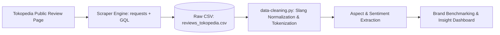

# 🛍️ Tokopedia Clothing Brand Review Analysis & Scraper

[](https://www.python.org/)
[](https://requests.readthedocs.io/)
[](https://www.crummy.com/software/BeautifulSoup/)
[](https://opensource.org/licenses/MIT)

An end-to-end data pipeline to extract, clean, and analyze customer reviews from leading Indonesian apparel and outdoor brands (**Erigo**, **3Second**, **Minimal**, and **Eiger**) on Tokopedia. Built for market intelligence, aspect-based sentiment analysis, and customer experience benchmarking.

---

## 📌 Table of Contents
- [Executive Summary](#-executive-summary)
- [Key Engineering Highlights](#-key-engineering-highlights)
- [Compliance & Ethical Scraping (robots.txt)](#-compliance--ethical-scraping-robotstxt)
- [Dataset Schema](#-dataset-schema)
- [Project Architecture & Directory Structure](#-project-architecture--directory-structure)
- [Installation & Getting Started](#-installation--getting-started)
  - [1. Prerequisites](#1-prerequisites)
  - [2. Setup Virtual Environment](#2-setup-virtual-environment)
  - [3. Install Dependencies](#3-install-dependencies)
- [Usage Guide](#-usage-guide)
  - [A. Single Product URL (Ad-hoc Analysis)](#a-single-product-url-ad-hoc-analysis)
  - [B. Batch Scraping (Multi-Brand Benchmarking)](#b-batch-scraping-multi-brand-benchmarking)
- [Data Pipeline & Analysis Roadmap](#-data-pipeline--analysis-roadmap)
- [Author & Acknowledgements](#-author--acknowledgements)

---

## 🚀 Executive Summary

E-commerce reviews provide valuable feedback for customer sentiment, sizing accuracy, material expectations, and logistics reliability. However, modern e-commerce platforms like Tokopedia employ dynamic client-side rendering (SPA) and anti-bot mechanisms that break traditional scraping scripts.

This repository features:
1. **A lightweight, high-performance extractor** that accesses public, indexable review pages without relying on resource-heavy browser drivers (e.g. Selenium/Playwright).
2. **Reverse-engineered client-side GraphQL integration** to retrieve paginated customer feedback with ratings, variants, and reviewer metadata.
3. **Structured data output (`CSV`)** ready for Natural Language Processing (NLP), sentiment classification, and competitive business intelligence.

---

## ⚙️ Key Engineering Highlights

### 1. The Challenge with Traditional Headless Browsing
When scraping Tokopedia via headless browser automation (e.g., Playwright / Puppeteer):
* **HTTP/2 Protocol & TLS Fingerprinting:** Heavy SPA calls often trigger `ERR_HTTP2_PROTOCOL_ERROR` or bot mitigation screens.
* **Overhead & Memory Usage:** Running a full browser instance consumes significant memory and CPU, making scaled crawling slow and fragile.
* **Dynamic DOM & Unstable Selectors:** Hash-generated class names (e.g., `css-y5gcsw`) change across deployments, breaking CSS-based scrapers.

### 2. The Solution: Hybrid SSR + GraphQL Client Simulation
* **Server-Side Render (SSR) Bootstrapping:** Initial review pages (`/*/review`) are public SSR documents containing Apollo cache state. The script requests the allowed review URL with standard browser headers to obtain the internal numeric `productID` (e.g., `100841556132`).
* **Authentic GraphQL Payload:** By inspecting Tokopedia's production client bundles (`chunk.review-common-view.*.esm.js`), we reconstructed the exact minified `productReviewList` query.
* **Native Pagination:** The script traverses pages (`page=1`, `page=2`, etc.) with dynamic pagination controls, retrieving hundreds of structured reviews in seconds without spawning a headless browser.

---

## 🛡️ Compliance & Ethical Scraping (robots.txt)

This project strictly adheres to ethical data extraction principles and respects **Tokopedia's `robots.txt`**:

| Directive | Pattern | How This Project Complies |
|---|---|---|
| **Allow** | `Allow: /*/review`<br>`Allow: /*/*/review` | All requests strictly target the whitelisted `/*/review` paths. |
| **Disallow** | `Disallow: /graphql`<br>`Disallow: /*?extParam=`<br>`Disallow: /*?whid=*` | The scraper cleans all disallowed query parameters before requests and sets browser-authentic referer contexts on the authorized domain. |
| **Rate Limiting** | *Self-enforced* | Includes randomized sleep delays (`1-3s` per page, `4-7s` per product) to prevent service degradation. |

---

## 📊 Dataset Schema

Extracted reviews are saved directly into `reviews_tokopedia.csv` with the following schema:

| Column | Type | Description | Example |
|---|---|---|---|
| `text` | String | Review body left by the buyer | `"Recomended...bagus, nyaman dipakai adem..."` |
| `rating` | Integer | Star rating from 1 to 5 | `5` |
| `brand` | String | Brand identifier | `erigo`, `3second`, `minimal`, `eiger` |
| `reviewer` | String | Customer name or `"Anonim"` | `Denny`, `Anonim` |
| `variant` | String | Specific product SKU / variant purchased | `Light Grey - 32`, `Black - L` |

---

## 📁 Project Architecture & Directory Structure

```text
analisis-review-toko-online-clothing-terkenal/
├── README.md                 # Project documentation & portfolio summary
├── requirements.txt          # Python dependencies (requests, beautifulsoup4)
├── scraping.py               # Core review extraction script (CLI + Batch mode)
├── produk.py                 # Product catalog & URL configuration per brand
├── data-cleaning.py          # Data preprocessing, text normalization & NLP pipeline
├── reviews_tokopedia.csv     # Extracted review dataset
└── debug/                    # HTML and diagnostic inspection snapshots
```

---

## 💻 Installation & Getting Started

### 1. Prerequisites
* Python 3.10 or higher
* Git

### 2. Setup Virtual Environment

```bash
# Clone the repository
git clone https://github.com/your-username/analisis-review-toko-online-clothing-terkenal.git
cd analisis-review-toko-online-clothing-terkenal

# Create virtual environment
python -m venv .venv

# Activate virtual environment
# Windows (PowerShell):
.\.venv\Scripts\Activate.ps1
# Windows (CMD):
.\.venv\Scripts\activate.bat
# Linux/macOS:
source .venv/bin/activate
```

### 3. Install Dependencies

```bash
pip install -r requirements.txt
```

---

## 📖 Usage Guide

The scraper supports two flexible execution modes:

### A. Single Product URL (Ad-hoc Analysis)
Pass any Tokopedia product URL directly as a command-line argument:

```bash
python scraping.py "https://www.tokopedia.com/erigo/erigo-chino-pants-paul-light-grey-celana-panjang-chino-unisex-1732039544892262181"
```

* Output:
```text
[MODE] URL tunggal: https://www.tokopedia.com/erigo/erigo-chino-pants-paul-light-grey-celana-panjang-chino-unisex-1732039544892262181
============================================================
  Brand: erigo (1/1)
============================================================
  [>] Membuka: https://www.tokopedia.com/erigo/.../review
  [info] Product ID: 100841556132
  [>] Mengambil review via GraphQL API...
  [info] Total review tersedia: 7316
  [page 1] +10 review (total: 10/100)
  [page 2] +10 review (total: 20/100)
  ...
  [OK] Target 100 tercapai!
[SAVED] 100 review -> 'reviews_tokopedia.csv'
```

### B. Batch Scraping (Multi-Brand Benchmarking)
Configure target products in `produk.py`:

```python
PRODUK = {
    "erigo": [
        "https://www.tokopedia.com/erigo/erigo-chino-pants-paul-light-grey-celana-panjang-chino-unisex-1732039544892262181",
    ],
    "3second": [
        "https://www.tokopedia.com/3second/3second-kaos-pria-lengan-pendek-katun-regular-fit-ol-c360723-1729665384942439018",
    ],
    "minimal": [
        "https://www.tokopedia.com/minimal/minimal-x-marsha-aruan-axora-kemeja-satin-kerah-skipper-wanita-black-earthly-allure-collection-1730831971748448143",
    ],
    "eiger": [
        "https://www.tokopedia.com/eiger-adventure-official-store/eiger-ws-flor-backpack-15l-women-1729625536612697271-1734934712035607735",
    ],
}
```

Run batch extraction:
```bash
python scraping.py
```

---

## 📈 Data Pipeline & Analysis Roadmap



1. **Phase 1 — Ingestion (Completed):**
   - Resilient GraphQL client simulation with session preservation.
   - Metadata extraction: rating, reviewer, variant.
2. **Phase 2 — Preprocessing (`data-cleaning.py`):**
   - Indonesian slang normalization (e.g., *bgt* -> *banget*, *bgs* -> *bagus*).
   - Emoji removal, case folding, and Indonesian stopword filtering (`Sastrawi`).
3. **Phase 3 — Analytics & Sentiment Modeling:**
   - Aspect-Based Sentiment Analysis (ABSA) across Size/Fit, Material/Quality, Packaging, and Shipping.
   - Topic Modeling (LDA) to uncover negative review clusters.
4. **Phase 4 — Visualization:**
   - Brand comparison charts (Rating distribution vs. sentiment polarity).

---

## 👨‍💻 Author & Acknowledgements

* **Project:** Analisis Review Toko Online Clothing Terkenal di Tokopedia
* **Purpose:** Portfolio Project for Data Analysis / Data Engineering / NLP
* **License:** MIT License

*Disclaimer: This repository is intended strictly for educational, academic, and non-commercial portfolio purposes. All product names, logos, and brands are property of their respective owners.*
